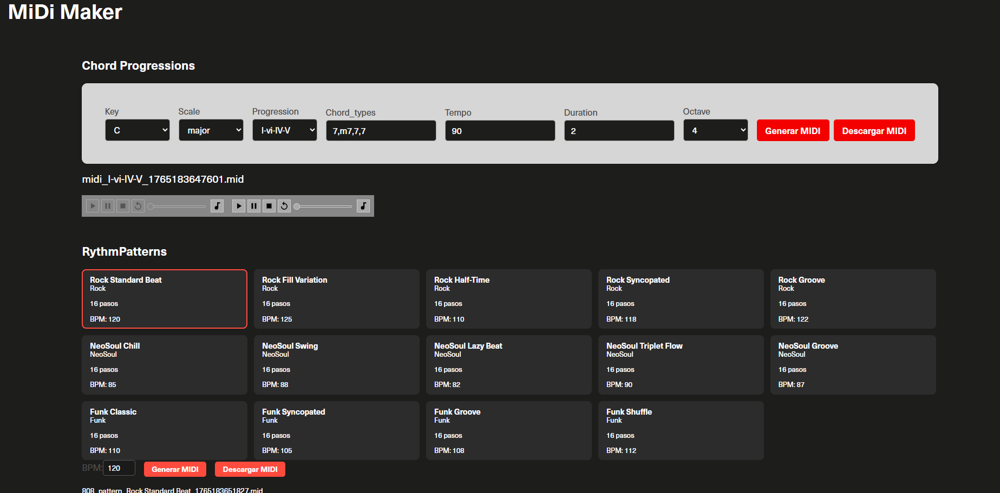

# MiDiMaker



### Local Dev Deploy

#### Backend server

```bash
pip3 install -r requirements.txt --break-system-packages
```

* Launch 

```bash
uvicorn app.main:app --reload
```

#### Frontedn server

```bash
npm run dev
````

[http://localhost:5173/](http://localhost:5173/)

